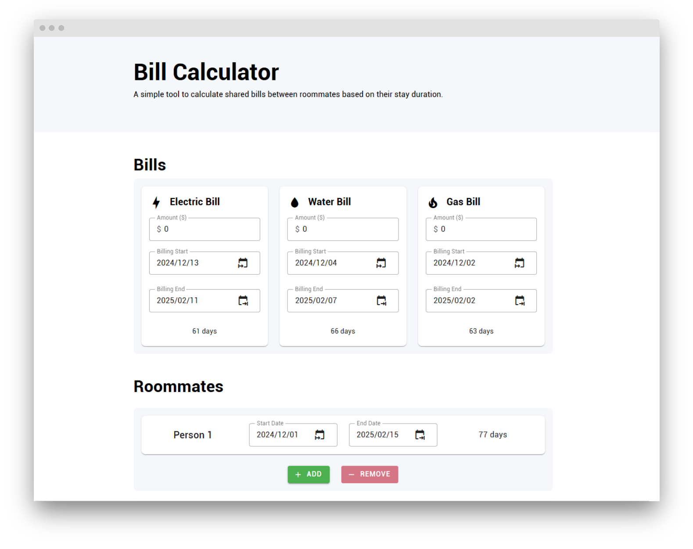

<div align="center">
  


<h1>Bill Calculator</h1>
<h4>
A simple tool to calculate shared bills between roommates based on their stay duration.
</h4>


<p align="center">
  <a href="#Preview">Preview</a> •
  <a href="#features">Features</a> •
  <a href="#license">License</a>
</p>
</div>

## Preview


## Features

- Support up to 3 bills (Electricity, Water, Gas)
- Add unlimited roommates
- Dark Mode
- i18n (en, zhHant, zhHans)

**Planning**<br>

- Save data to local storage
- PWA

## Installation

No installation required. Just visit the [website](https://bill.tmlwu.net) to use the tool.

## Run Locally

### Recommended IDE Setup

[VSCode](https://code.visualstudio.com/) + [Volar](https://marketplace.visualstudio.com/items?itemName=Vue.volar) (and disable Vetur).

### Type Support for .vue Imports in TS

TypeScript cannot handle type information for `.vue` imports by default, so we replace the `tsc` CLI with `vue-tsc` for type checking. In editors, we need [Volar](https://marketplace.visualstudio.com/items?itemName=Vue.volar) to make the TypeScript language service aware of `.vue` types.

### Project setup

- Install

    ```sh
    npm install
    ```

- Compile and Hot-Reload for **Development**

    ```sh
    npm run dev
    ```

- Type-Check, Compile and Minify for **Production**

    ```sh
    npm run build
    ```

-  Lint with [ESLint](https://eslint.org/)

    ```sh
    npm run lint
    ```

## Contributing

Contributions are always welcome!

See `contributing.md` for ways to get started.

Please adhere to this project's `code of conduct`.

## License

[LICENSE.md](./LICENSE)

```
MIT License

Copyright (c) 2025

Permission is hereby granted, free of charge, to any person obtaining a copy
of this software and associated documentation files (the "Software"), to deal
in the Software without restriction, including without limitation the rights
to use, copy, modify, merge, publish, distribute, sublicense, and/or sell
copies of the Software, and to permit persons to whom the Software is
furnished to do so, subject to the following conditions:

The above copyright notice and this permission notice shall be included in all
copies or substantial portions of the Software.

THE SOFTWARE IS PROVIDED "AS IS", WITHOUT WARRANTY OF ANY KIND, EXPRESS OR
IMPLIED, INCLUDING BUT NOT LIMITED TO THE WARRANTIES OF MERCHANTABILITY,
FITNESS FOR A PARTICULAR PURPOSE AND NONINFRINGEMENT. IN NO EVENT SHALL THE
AUTHORS OR COPYRIGHT HOLDERS BE LIABLE FOR ANY CLAIM, DAMAGES OR OTHER
LIABILITY, WHETHER IN AN ACTION OF CONTRACT, TORT OR OTHERWISE, ARISING FROM,
OUT OF OR IN CONNECTION WITH THE SOFTWARE OR THE USE OR OTHER DEALINGS IN THE
SOFTWARE.
```